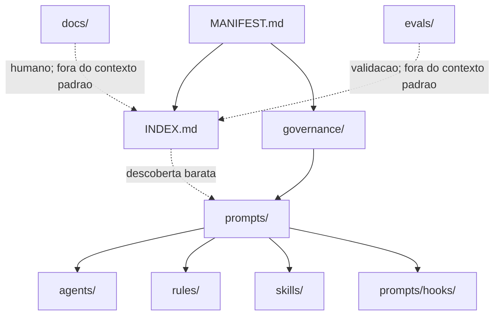

# agent-ops

## Tipo do artefato

readme / discovery

## Finalidade

`agent-ops` organiza contexto operacional para agentes de IA em engenharia de dados.

O projeto nao e uma pasta de prompts. Ele e uma camada leve de governanca para selecionar, compor, executar e validar contexto com baixa ambiguidade.

`agent-ops` e a identidade oficial. Prompts sao uma categoria dentro do sistema.

O modelo oficial e:

```txt
find -> select -> inject
```

A fonte normativa de maior precedencia e:

- `./MANIFEST.md`

Para descoberta inicial barata por LLM, use:

- `./INDEX.md`

`README.md` e o guia humano principal. `INDEX.md` e apenas um roteador compacto para escolher o primeiro arquivo operacional.

---

## Diagrama



## Status v0.1

Status atual: liberado para tag v0.1 como base de governanca operacional para piloto profissional controlado.

Escopo aprovado:

- descoberta e composicao seletiva de contexto
- prompts, agents, rules, skills e hooks em Markdown
- guardrails de geracao, seguranca operacional, naming e crescimento
- suite manual minima de regressao em `./evals/`

Restricao explicita: producao critica ainda requer controles externos de runtime, autorizacao, observabilidade, auditoria, segredo, isolamento e enforcement fora deste repositorio.

Este repositorio governa contexto e comportamento esperado. Ele nao substitui plataforma de execucao, controle de acesso, monitoramento ou aprovacao operacional.

---

## Principio de uso

Use apenas o contexto necessario.

O agente deve descobrir artefatos, selecionar os relevantes e injetar o minimo suficiente para executar com seguranca.

```txt
prompt -> governance -> agent -> rules -> skills
```

Hooks entram apenas como checkpoints relevantes ou obrigatorios por risco.

`docs/`, `evals/` e `LICENSE` nao entram na composicao padrao.

---

## Estrutura do repositorio

```txt
agent-ops/
├── MANIFEST.md
├── INDEX.md
├── README.md
├── LICENSE
├── governance/
├── agents/
├── rules/
├── skills/
├── prompts/
├── docs/
└── evals/
```

## Dominio de cada area

| Area | Por que existe | Quando consultar |
|---|---|---|
| `MANIFEST.md` | Define contrato estrutural, precedencia e taxonomia. | Quando houver duvida sobre onde algo pertence ou qual norma prevalece. |
| `INDEX.md` | Roteia descoberta inicial barata para LLM. | Quando o ponto de partida ainda nao estiver claro. |
| `governance/` | Governa estrutura, composicao, autoria, qualidade e lifecycle do proprio `agent-ops`. | Quando for criar, alterar, mover, dividir ou validar artefatos do repositorio. |
| `agents/` | Define perfis executores com missao, escopo, limites e dependencias. | Quando precisar escolher quem executa uma tarefa. |
| `rules/` | Define normas de output, guardrails e restricoes de comportamento. | Quando precisar validar ou limitar a saida do agente. |
| `skills/` | Define procedimentos e conhecimento operacional reutilizavel. | Quando a tarefa exigir tecnica especializada. |
| `prompts/` | Define pontos de entrada para tarefas e fluxos. | Quando houver uma solicitacao concreta a executar. |
| `prompts/hooks/` | Define checkpoints de validacao. | Quando houver risco, conclusao, conformidade ou gate de revisao. |
| `docs/` | Explica o projeto para humanos. | Quando uma pessoa precisar aprender, operar ou auditar o repositorio. |
| `evals/` | Valida comportamento esperado e regressao. | Quando precisar provar que prompts, rules ou fluxos continuam confiaveis. |

---

## Workflows principais

### 1. Descobrir contexto

Use quando a tarefa ainda nao deixa claro quais artefatos carregar.

```txt
prompts/discovery/discover-required-context.md
-> governance/composition/context-composition.md
-> roteadores de agents/rules/skills conforme necessidade
```

Saida esperada: lista de caminhos, motivo de selecao e lacunas.

### 2. Planejar tarefa

Use quando a execucao exige decomposicao antes de gerar ou alterar algo.

```txt
prompts/planning/plan-data-task.md
-> governance/composition/context-composition.md
-> agent/rules/skills candidatos
```

Saida esperada: plano sequencial, contexto obrigatorio, riscos e criterios de aceite.

### 3. Gerar solucao

Use quando houver objetivo, artefato esperado e contexto minimo.

```txt
prompts/generation/generate-data-solution.md
-> governance/
-> agent adequado
-> rules relevantes
-> skills necessarias
```

Se houver SQL, arquivos, dados sensiveis, execucao ou acao destrutiva, carregue:

- `rules/generation/operational-safety-guardrails.md`
- `prompts/hooks/validate-operational-safety.md`

### 4. Revisar solucao

Use quando ja existe artefato ou proposta a avaliar.

```txt
prompts/review/review-data-solution.md
-> rules/quality/quality-rules.md
-> rules especificas do artefato
-> skills/review/ quando necessario
```

Saida esperada: achados com evidencia, impacto e recomendacao.

### 5. Validar checkpoint

Use antes de concluir, aprovar, aplicar grow ou executar tarefa de risco.

```txt
prompts/hooks/validate-context-and-output.md
prompts/hooks/validate-growth-proposal.md
prompts/hooks/validate-operational-safety.md
prompts/hooks/validate-semantic-naming-conformance.md
```

Hooks nao substituem prompts principais; eles validam gates.

### 6. Evoluir o repositorio com grow

Use quando uma execucao anterior deve gerar conhecimento reutilizavel.

```txt
prompts/grow-from-execution.md
-> agents/agentops-growth-architect.md
-> rules/growth-artifact-quality.md
-> skills/grow-from-execution.md
-> prompts/hooks/validate-growth-proposal.md
```

Grow deve destilar conhecimento. Nao deve copiar historico bruto.

### 7. Validar regressao

Use antes de considerar uma mudanca pronta.

```txt
evals/manual-regression-suite.md
```

`evals/` valida comportamento; nao cria norma primaria.

---

## Diretórios nao oficiais na v0.1

`tasks/`, `workflows/` e `policies/` nao sao diretorios oficiais da v0.1.

Nesta versao:

- tarefas ficam em `prompts/`
- workflows sao composicoes de `prompts/`, `skills/` e `prompts/hooks/`
- politicas estruturais ficam em `governance/`
- guardrails e restricoes de output ficam em `rules/`

---

## Regras de uso

- Todo contexto injetavel deve ser Markdown.
- Cada arquivo deve ter responsabilidade principal clara.
- Dependencias devem ser referenciadas por caminho.
- Conteudo duplicado deve ser extraido para fonte primaria.
- `docs/` e `evals/` nao devem ser carregados por padrao.
- O agente deve sinalizar lacunas antes de inventar contexto.
- Operacoes de alto risco exigem guardrail operacional e checkpoint.

---

## Precedencia normativa

Em caso de conflito:

1. `./MANIFEST.md`
2. `./governance/`
3. diretorio especializado aplicavel
4. `README.md`
5. `INDEX.md`

---

## Expectativa de comportamento

Ao consumir este repositorio, o agente deve:

- preservar `find -> select -> inject`
- evitar leitura indiscriminada
- escolher contexto minimo suficiente
- respeitar fonte primaria
- aplicar guardrails em situacoes criticas
- validar antes de concluir quando houver risco
