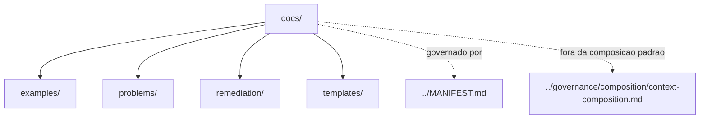

# docs

Esta pasta é documentação humana. Ela ajuda pessoas a usar o `agent-ops`, mas não é contexto injetável por padrão.

A fonte normativa continua sendo:

- `../MANIFEST.md`
- `../governance/`
- diretório operacional aplicável

## Como usar

Use `problems/` quando tiver uma dúvida prática, como escolher prompt, agente, rule, skill ou hook.

Use `examples/` para ver composições pequenas antes de pedir execução a um agente.

Use `remediation/` para acompanhar fluxos humanos de correção derivados de auditorias.

Use `../evals/` para validar regressão, comportamento esperado ou critérios de aceite.

Use `templates/` para criar novos artefatos sem copiar arquivos grandes existentes.

## Problemas comuns

- escolher prompt: `./problems/choosing-a-prompt.md`
- escolher agente: `./problems/choosing-an-agent.md`
- selecionar rules: `./problems/selecting-rules.md`
- selecionar skills: `./problems/selecting-skills.md`
- usar hooks: `./problems/using-hooks.md`
- criar artefato: `./problems/creating-new-artifact.md`
- evitar duplicação: `./problems/avoiding-duplication.md`
- usar grow: `./problems/using-grow.md`
- reduzir tokens: `./problems/reducing-token-usage.md`
- usar modelos simples: `./problems/using-simple-models.md`
- validar responsabilidade: `./problems/validating-responsibility.md`
- resolver seleção de contexto: `./problems/troubleshooting-context-selection.md`
- orquestrar remediações de auditoria: `./remediation/audit-remediation-orchestration.md`
- validar regressões: `../evals/README.md`
- criar artefato por template: `./templates/new-artifact.md`

## Regra prática

Comece pelo problema, encontre os arquivos operacionais indicados e aplique:

```txt
find -> select -> inject
```

Não carregue `docs/` nem `../evals/` como parte da composição padrão.

---

## Diagrama



## Status v0.1

Este diretorio faz parte da base v0.1 no escopo descrito neste README.

Uso aprovado: piloto profissional controlado. Producao critica exige controles externos de runtime, autorizacao, observabilidade e enforcement fora deste repositorio.
