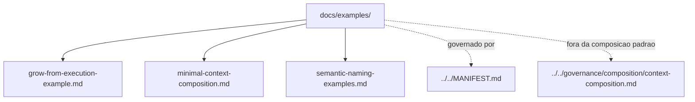

# examples

## Tipo do artefato

human documentation / examples

## Finalidade

Este diretorio existe para mostrar exemplos de composicao, uso e comportamento esperado do `agent-ops`.

Ele ajuda humanos a entender como aplicar `find -> select -> inject` sem carregar o repositorio inteiro.

---

## Quando usar

Use `examples/` quando precisar:

- ver uma composicao minima
- entender como pedir uma execucao a um agente
- comparar um fluxo simples com a estrutura real do repositorio
- consultar exemplos completos que nao devem entrar no contexto padrao

---

## Quando nao usar

Nao use `examples/` como:

- fonte normativa primaria
- prompt de tarefa
- rule
- skill
- contexto injetavel padrao

Consulte, respectivamente:

- `../../MANIFEST.md`
- `../../prompts/`
- `../../rules/`
- `../../skills/`

---

## Arquivos

- `./minimal-context-composition.md`
- `./grow-from-execution-example.md`
- `./semantic-naming-examples.md`

---

## Limites

Exemplos explicam uso. Eles nao definem governanca.

---

## Diagrama

## Diagrama

## Status v0.1

Este diretorio faz parte da base v0.1 no escopo descrito neste README.

Uso aprovado: piloto profissional controlado. Producao critica exige controles externos de runtime, autorizacao, observabilidade e enforcement fora deste repositorio.
