```mermaid
flowchart TD
    current["docs/problems/"]
    current --> n1["avoiding-duplication.md"]
    current --> n2["choosing-an-agent.md"]
    current --> n3["choosing-a-prompt.md"]
    current --> n4["creating-new-artifact.md"]
    current --> n5["reducing-token-usage.md"]
    current --> n6["selecting-rules.md"]
    current --> n7["selecting-skills.md"]
    current --> n8["troubleshooting-context-selection.md"]
    current --> n9["using-grow.md"]
    current --> n10["using-hooks.md"]
    current --> n11["using-simple-models.md"]
    current --> n12["validating-responsibility.md"]
    current -. "governado por" .-> n13["../../MANIFEST.md"]
    current -. "fora da composicao padrao" .-> n14["../../governance/composition/context-composition.md"]
```

# problems

## Tipo do artefato

human documentation / problem guides

## Finalidade

Este diretorio existe para orientar humanos diante de duvidas praticas recorrentes.

Cada arquivo parte de um problema operacional e aponta quais artefatos consultar.

---

## Quando usar

Use `problems/` quando precisar decidir:

- qual prompt usar
- qual agente escolher
- quais rules carregar
- quais skills carregar
- quando usar hooks
- como criar ou revisar artefatos

---

## Quando nao usar

Nao use `problems/` como:

- fonte normativa primaria
- substituto de `MANIFEST.md`
- prompt executavel
- rule ou skill

---

## Regra de uso

Depois de ler um guia, volte para os artefatos operacionais indicados.

`docs/problems/` orienta humanos; nao entra na composicao padrao.

---

## Diagrama

## Diagrama

## Status v0.1

Este diretorio faz parte da base v0.1 no escopo descrito neste README.

Uso aprovado: piloto profissional controlado. Producao critica exige controles externos de runtime, autorizacao, observabilidade e enforcement fora deste repositorio.
