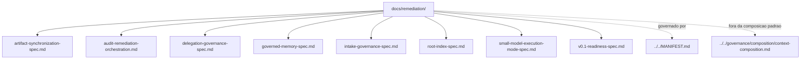

# remediation

## Tipo do artefato

human documentation / remediation tracking

## Finalidade

Este diretorio existe para registrar fluxos humanos de remediacao derivados de auditorias.

Ele transforma achados em fila de execucao com gates, responsaveis sugeridos e criterios de aceite.

---

## Quando usar

Use `remediation/` quando precisar:

- acompanhar remediacoes abertas
- registrar passagem por gates
- preservar evidencia de revisao
- evitar que achados de auditoria virem lista solta

---

## Quando nao usar

Nao use `remediation/` como:

- fonte normativa primaria
- prompt executavel
- rule
- skill
- eval

Consulte, respectivamente:

- `../../MANIFEST.md`
- `../../prompts/`
- `../../rules/`
- `../../skills/`
- `../../evals/`

---

## Arquivos

- `./artifact-synchronization-spec.md`
- `./audit-remediation-orchestration.md`
- `./delegation-governance-spec.md`
- `./governed-memory-spec.md`
- `./intake-governance-spec.md`
- `./root-index-spec.md`
- `./small-model-execution-mode-spec.md`
- `./v0.1-readiness-spec.md`

---

## Limites

Este diretorio registra controle humano de remediacao.

Ele nao altera a precedencia normativa do repositorio e nao entra na composicao padrao.

---

## Diagrama

## Status v0.1

Este diretorio faz parte da base v0.1 no escopo descrito neste README.

Uso aprovado: piloto profissional controlado. Producao critica exige controles externos de runtime, autorizacao, observabilidade e enforcement fora deste repositorio.
