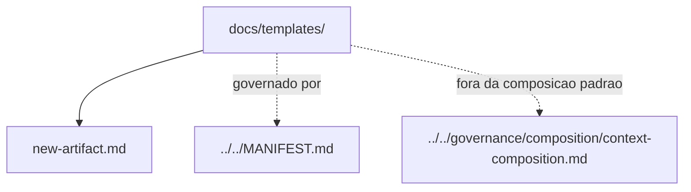

# templates

## Tipo do artefato

human documentation / templates

## Finalidade

Este diretorio existe para oferecer modelos humanos curtos para criar ou revisar artefatos do `agent-ops`.

Templates reduzem copia improvisada e ajudam pessoas com pouco contexto a seguir a estrutura minima.

---

## Quando usar

Use `templates/` quando precisar:

- criar novo artefato
- revisar se um artefato tem secoes minimas
- evitar duplicar exemplos extensos de arquivos existentes

---

## Quando nao usar

Nao use `templates/` como:

- fonte normativa primaria
- prompt executavel
- rule
- skill
- contexto injetavel padrao

Consulte:

- `../../MANIFEST.md`
- `../../governance/authoring/markdown-authoring-standard.md`
- `../../governance/quality/artifact-quality-standard.md`
- `../../governance/lifecycle/artifact-lifecycle-policy.md`

---

## Arquivos

- `./new-artifact.md`

---

## Limites

Templates orientam autoria humana.

Eles nao substituem manifesto, governance ou rules.

---

## Diagrama

## Diagrama

## Status v0.1

Este diretorio faz parte da base v0.1 no escopo descrito neste README.

Uso aprovado: piloto profissional controlado. Producao critica exige controles externos de runtime, autorizacao, observabilidade e enforcement fora deste repositorio.
