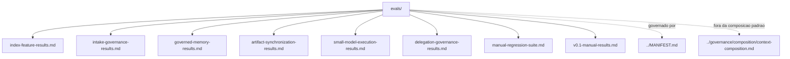

# evals

## Tipo do artefato

validation / human-review

## Finalidade

`evals/` define validacoes manuais e incrementais para prompts, rules, agents, skills, hooks e governance do `agent-ops`.

Este diretorio nao faz parte do nucleo injetavel e nao deve ser carregado por padrao em execucoes agenticas.

Use este diretorio para:

- validar regressao semantica
- testar comportamento diante de ambiguidade
- testar resistencia a prompt injection
- validar guardrails operacionais
- sustentar criterios objetivos para v0.1

---

## Quando usar

Use `evals/` quando precisar:

- validar mudancas antes de concluir uma remediacao
- revisar se um prompt continua produzindo saida aceitavel
- comparar comportamento esperado contra comportamento observado
- sustentar decisao `PASS`, `FAIL` ou `CONDITIONAL`

---

## Quando nao usar

Nao use `evals/` como:

- fonte normativa primaria
- prompt de tarefa
- skill operacional
- documentacao humana geral
- contexto injetavel padrao

Consulte, respectivamente:

- `../MANIFEST.md`
- `../prompts/`
- `../skills/`
- `../docs/`
- `../governance/composition/context-composition.md`

---

## Como executar manualmente

1. Escolha um caso em `./manual-regression-suite.md`.
2. Carregue somente os artefatos indicados no caso.
3. Execute o prompt ou fluxo descrito.
4. Compare a saida observada com o comportamento esperado.
5. Registre `PASS`, `FAIL` ou `CONDITIONAL`.
6. Abra remediacao quando houver falha relevante.

---

## Contrato de resultado

```txt
Eval ID:
Data:
Executor:
Modo de validacao:
Artefatos carregados:
Entrada usada:
Saida observada:
Resultado: PASS | FAIL | CONDITIONAL
Divergencias:
Acao recomendada:
```

---

## Suite inicial

- `./index-feature-results.md`
- `./intake-governance-results.md`
- `./governed-memory-results.md`
- `./artifact-synchronization-results.md`
- `./small-model-execution-results.md`
- `./delegation-governance-results.md`
- `./manual-regression-suite.md`
- `./v0.1-manual-results.md`

---

## Limites

Esta suite inicial e manual por decisao de v0.1.

Automacao so deve ser adicionada quando reduzir ambiguidade sem introduzir dependencia pesada, vendor lock-in ou manutencao desproporcional.

---

## Diagrama



## Status v0.1

Este diretorio faz parte da base v0.1 no escopo descrito neste README.

Uso aprovado: piloto profissional controlado. Producao critica exige controles externos de runtime, autorizacao, observabilidade e enforcement fora deste repositorio.
