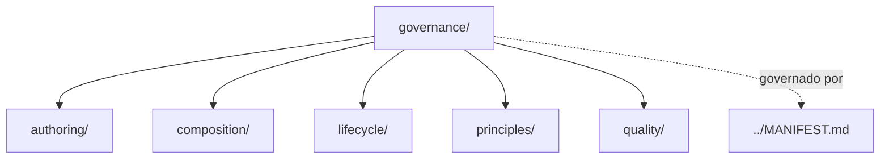

# governance

## Tipo do artefato

discovery

## Finalidade

O diretório `governance/` define como o sistema de artefatos do `agent-ops` deve ser estruturado, mantido, evoluído e validado.

`governance/` governa o ecossistema de contexto.

Este diretório define regras sobre:

- organização
- composição
- autoria
- qualidade
- lifecycle
- SOLID e injeção de dependências em Markdown
- não duplicação
- crescimento sustentável

A norma de maior precedência continua sendo:

- `../MANIFEST.md`

---

## Dependências relacionadas

- `../MANIFEST.md`

---

## Quando usar

Consulte `governance/` quando precisar:

- entender como o `agent-ops` funciona
- decidir onde um novo artefato deve ser criado
- validar se um arquivo está no diretório correto
- padronizar criação e manutenção de `.md`
- revisar composição de contexto
- evitar duplicação
- orientar crescimento estrutural do repositório

---

## Quando não usar

Não use `governance/` como fonte primária para:

- padrões técnicos de output
- regras de código
- skill operacional
- definição de agente
- template de solicitação de tarefa

Esses conteúdos pertencem, respectivamente, a:

- `../rules/`
- `../skills/`
- `../agents/`
- `../prompts/`

---

## Responsabilidade desta pasta

`governance/` MUST governar o sistema de artefatos.

`governance/` MUST NOT governar diretamente a saída técnica produzida pelos agentes, exceto quando a regra disser respeito ao próprio sistema `agent-ops`.

---

## Limites

Este README roteia a governança estrutural do `agent-ops`.

Este README não substitui:

- políticas específicas em subdiretórios de `governance/`
- regras técnicas em `../rules/`
- skills em `../skills/`
- prompts em `../prompts/`

---

## Estrutura interna alvo

```txt
governance/
├── README.md
├── principles/
├── composition/
├── authoring/
├── lifecycle/
└── quality/
```

### `principles/`
Princípios fundacionais permanentes.

### `composition/`
Regras de descoberta, seleção e injeção de contexto.

### `authoring/`
Padrões de escrita e estrutura de arquivos `.md`.

### `lifecycle/`
Regras para criar, dividir, consolidar, mover ou remover artefatos.

### `quality/`
Critérios de qualidade e consistência do repositório.

---

## Fronteiras

### Pode conter
- regras estruturais
- convenções de organização
- regras de decomposição
- regras de autoria
- critérios de qualidade do repositório
- política de referência por caminho
- política anti-duplicação

### Não pode conter
- norma técnica primária de output
- skill operacional especializada
- perfil de agente
- prompt de tarefa

---

## Relação com os demais diretórios

- governa `../agents/`
- governa `../rules/`
- governa `../skills/`
- governa `../prompts/`

`governance/` é base padrão do modelo de composição definido em:

- `../MANIFEST.md`

---

## Uso pelo agente

Ao consumir `governance/`, o agente deve:

- atuar como defensor da estrutura
- preservar responsabilidade única
- evitar duplicação
- respeitar referência por caminho
- sinalizar conflitos estruturais antes de propor conteúdo novo

---

## Diagrama



## Status v0.1

Este diretorio faz parte da base v0.1 no escopo descrito neste README.

Uso aprovado: piloto profissional controlado. Producao critica exige controles externos de runtime, autorizacao, observabilidade e enforcement fora deste repositorio.
