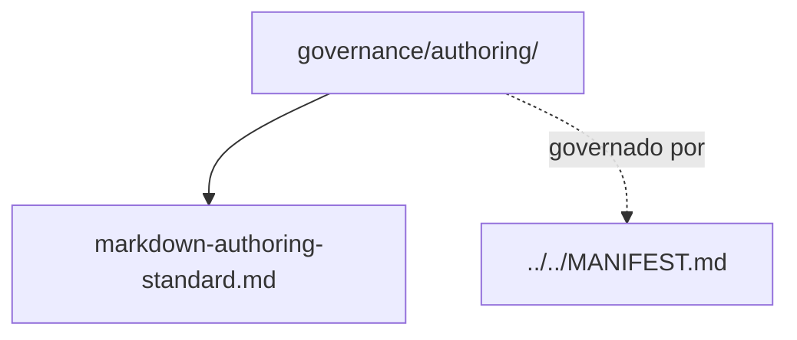

# authoring

## Tipo do artefato

discovery

## Finalidade

O diretório `authoring/` define como arquivos `.md` do `agent-ops` devem ser escritos, estruturados e apresentados.

Este diretório é a fonte primária para padronização de autoria.

A norma de maior precedência continua sendo:

- `../../MANIFEST.md`

---

## Dependências relacionadas

- `../../MANIFEST.md`
- `../README.md`

---

## Quando usar

Consulte `authoring/` quando precisar:

- criar novo arquivo `.md`
- revisar estrutura de um arquivo existente
- padronizar seções e linguagem
- melhorar legibilidade para humanos e agentes
- declarar dependências e limites de forma correta

---

## Quando não usar

Não use `authoring/` como fonte primária para:

- princípios fundacionais
- composição de contexto
- política de lifecycle
- critérios de qualidade

Consulte, respectivamente:

- `../principles/core-principles.md`
- `../composition/context-composition.md`
- `../lifecycle/artifact-lifecycle-policy.md`
- `../quality/artifact-quality-standard.md`

---

## Arquivo primário

- `./markdown-authoring-standard.md`

---

## Responsabilidade desta pasta

`authoring/` MUST definir como escrever artefatos.

`authoring/` MUST NOT definir regras primárias de composição, lifecycle ou qualidade.

---

## Limites

Este README roteia padrões de autoria.

Este README não substitui `./markdown-authoring-standard.md`.

---

## Diagrama

## Status v0.1

Este diretorio faz parte da base v0.1 no escopo descrito neste README.

Uso aprovado: piloto profissional controlado. Producao critica exige controles externos de runtime, autorizacao, observabilidade e enforcement fora deste repositorio.
