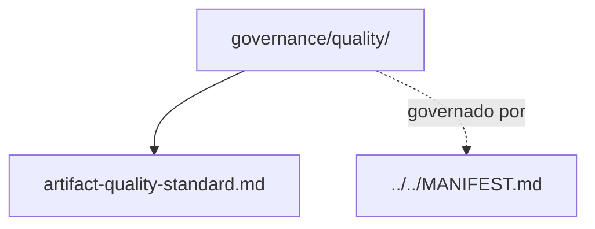

# quality

## Tipo do artefato

discovery

## Finalidade

O diretório `quality/` define os critérios de qualidade exigidos para artefatos do `agent-ops`.

Este diretório é a fonte primária para avaliação de qualidade dos arquivos `.md`.

A norma de maior precedência continua sendo:

- `../../MANIFEST.md`

---

## Dependências relacionadas

- `../../MANIFEST.md`
- `../README.md`

---

## Quando usar

Consulte `quality/` quando precisar:

- revisar se um artefato está aceitável
- validar completude mínima
- identificar ambiguidade
- verificar rastreabilidade
- avaliar se um arquivo está pronto para uso em contexto

---

## Quando não usar

Não use `quality/` como fonte primária para:

- princípios fundacionais
- composição de contexto
- padrão de autoria
- lifecycle dos artefatos

Consulte, respectivamente:

- `../principles/core-principles.md`
- `../composition/context-composition.md`
- `../authoring/markdown-authoring-standard.md`
- `../lifecycle/artifact-lifecycle-policy.md`

---

## Arquivo primário

- `./artifact-quality-standard.md`

---

## Responsabilidade desta pasta

`quality/` MUST definir critérios de qualidade dos artefatos.

`quality/` MUST NOT substituir princípios, composição, autoria ou lifecycle.

---

## Limites

Este README roteia padrões de qualidade de artefato.

Este README não substitui `./artifact-quality-standard.md`.

---

## Diagrama

## Status v0.1

Este diretorio faz parte da base v0.1 no escopo descrito neste README.

Uso aprovado: piloto profissional controlado. Producao critica exige controles externos de runtime, autorizacao, observabilidade e enforcement fora deste repositorio.
