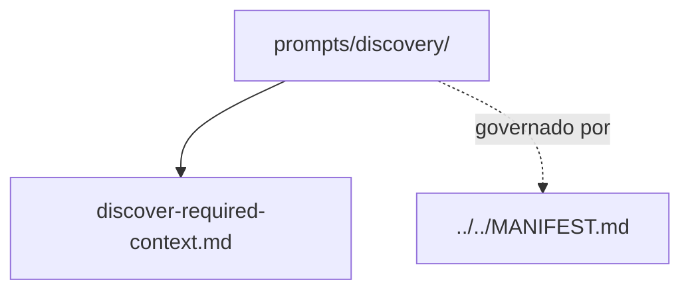

# discovery

## Tipo do artefato

discovery

## Finalidade

O diretório `discovery/` define prompts de entrada para descoberta do contexto necessário antes da execução.

Este diretório é a fonte primária para prompts de discovery.

A norma de maior precedência continua sendo:

- `../../MANIFEST.md`

---

## Dependências relacionadas

- `../../MANIFEST.md`
- `../README.md`

---

## Quando usar

Consulte `discovery/` quando precisar:

- descobrir quais artefatos carregar
- reduzir injeção excessiva
- selecionar agente, rules e skills adequadas
- estruturar entendimento inicial da tarefa

---

## Quando não usar

Não use `discovery/` como fonte primária para:

- geração
- revisão
- planejamento detalhado de execução
- checkpoint de validação

Consulte, respectivamente:

- `../generation/`
- `../review/`
- `../planning/`
- `../hooks/`

---

## Arquivo primário

- `./discover-required-context.md`

---

## Responsabilidade desta pasta

`discovery/` MUST definir prompts para descoberta de contexto.

`discovery/` MUST NOT substituir composição normativa, governança ou regras.

---

## Limites

Este README roteia prompts de discovery.

Este README não substitui `./discover-required-context.md`.

---

## Diagrama

## Status v0.1

Este diretorio faz parte da base v0.1 no escopo descrito neste README.

Uso aprovado: piloto profissional controlado. Producao critica exige controles externos de runtime, autorizacao, observabilidade e enforcement fora deste repositorio.
