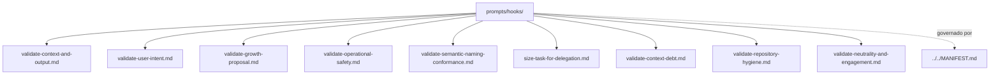

# hooks

## Tipo do artefato

discovery

## Finalidade

O diretório `hooks/` define prompts de checkpoint e validação ao longo do fluxo de trabalho.

Este diretório é a fonte primária para prompts de validação contextual.

A norma de maior precedência continua sendo:

- `../../MANIFEST.md`

---

## Dependências relacionadas

- `../../MANIFEST.md`
- `../README.md`

---

## Quando usar

Consulte `hooks/` quando precisar:

- validar aderência a `governance/`
- validar aderência a `rules/`
- validar intenção, ambiguidade e risco do pedido humano antes de discovery
- dimensionar tarefa grande antes de delegacao
- auditar divida de contexto quando houver redundancia, custo alto ou local incorreto
- validar higiene mecanica do repositorio
- validar neutralidade e remover engajamento artificial
- revisar conformidade antes de concluir
- aplicar checkpoint de controle em geração ou revisão

---

## Quando não usar

Não use `hooks/` como fonte primária para:

- geração inicial
- discovery de contexto
- planejamento da tarefa
- skill de revisão técnica
- regra normativa primária

Consulte, respectivamente:

- `../generation/`
- `../discovery/`
- `../planning/`
- `../../skills/review/`
- `../../rules/`

---

## Arquivo primário

- `./validate-context-and-output.md`

## Hooks disponíveis

- `./validate-context-and-output.md`
- `./validate-user-intent.md`
- `./size-task-for-delegation.md`
- `./validate-context-debt.md`
- `./validate-repository-hygiene.md`
- `./validate-neutrality-and-engagement.md`
- `./validate-semantic-naming-conformance.md`
- `./validate-growth-proposal.md`
- `./validate-operational-safety.md`

---

## Responsabilidade desta pasta

`hooks/` MUST definir prompts de checkpoint e validação.

`hooks/` MUST NOT conter hooks executáveis, scripts ou automações.

---

## Limites

Este README roteia hooks de validação.

Este README não substitui hooks específicos deste diretório.

---

## Diagrama

## Status v0.1

Este diretorio faz parte da base v0.1 no escopo descrito neste README.

Uso aprovado: piloto profissional controlado. Producao critica exige controles externos de runtime, autorizacao, observabilidade e enforcement fora deste repositorio.
