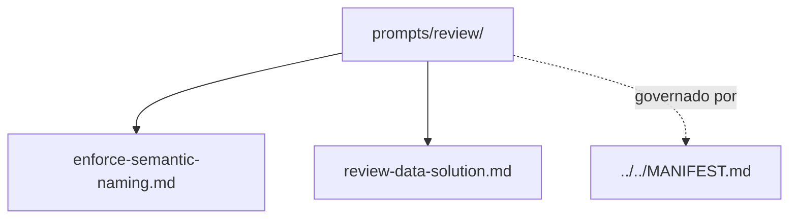

# review

## Tipo do artefato

discovery

## Finalidade

O diretório `review/` define prompts de entrada para revisão de soluções e artefatos no contexto de engenharia de dados.

Este diretório é a fonte primária para prompts de revisão.

A norma de maior precedência continua sendo:

- `../../MANIFEST.md`

---

## Dependências relacionadas

- `../../MANIFEST.md`
- `../README.md`

---

## Quando usar

Consulte `review/` quando precisar:

- revisar artefato existente
- conduzir análise crítica
- verificar aderência técnica e normativa
- estruturar uma revisão com contexto controlado

---

## Quando não usar

Não use `review/` como fonte primária para:

- geração inicial
- discovery de contexto
- planejamento de execução
- checkpoint de validação formal

Consulte, respectivamente:

- `../generation/`
- `../discovery/`
- `../planning/`
- `../hooks/`

---

## Arquivo primário

- `./review-data-solution.md`

---

## Responsabilidade desta pasta

`review/` MUST definir prompts de entrada para revisão.

`review/` MUST NOT substituir skills de revisão, regras normativas ou governança.

---

## Limites

Este README roteia prompts de revisão.

Este README não substitui prompts específicos deste diretório.

---

## Diagrama

## Status v0.1

Este diretorio faz parte da base v0.1 no escopo descrito neste README.

Uso aprovado: piloto profissional controlado. Producao critica exige controles externos de runtime, autorizacao, observabilidade e enforcement fora deste repositorio.
