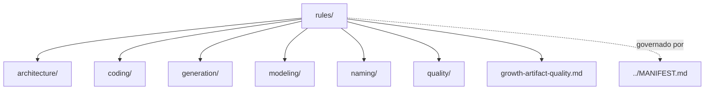

# rules

## Tipo do artefato

discovery

## Finalidade

O diretório `rules/` define as normas e restrições que governam a saída produzida pelos agentes e, quando aplicável, a qualidade da entrada humana antes da execução.

`rules/` é a fonte primária para padrões de output.

Este diretório deve concentrar normas sobre:

- crescimento controlado de artefatos
- arquitetura
- implementação
- modelagem
- nomenclatura
- qualidade
- qualidade da entrada humana
- comunicacao tecnica neutra
- limites de delegacao e decomposicao
- guardrails de geração

A norma de maior precedência continua sendo:

- `../MANIFEST.md`

---

## Dependências relacionadas

- `../MANIFEST.md`
- `../governance/principles/core-principles.md`
- `../governance/composition/context-composition.md`

---

## Quando usar

Consulte `rules/` quando precisar:

- garantir aderência arquitetural
- padronizar implementação
- seguir convenções de naming
- aplicar padrões de modelagem
- validar qualidade obrigatória
- validar se um pedido humano pode seguir para discovery
- validar se uma resposta evita bajulacao e engajamento artificial
- validar se uma tarefa grande pode ser delegada com limites claros
- restringir comportamento de geração

---

## Quando não usar

Não use `rules/` como fonte primária para:

- governança do `agent-ops`
- definição de persona de agente
- skill operacional reutilizável
- prompt de tarefa

Esses conteúdos pertencem, respectivamente, a:

- `../governance/`
- `../agents/`
- `../skills/`
- `../prompts/`

---

## Responsabilidade desta pasta

`rules/` MUST governar a saída produzida pelos agentes.

`rules/` MAY governar a entrada humana quando isso reduzir ambiguidade, risco ou execução insegura.

`rules/` MUST NOT governar a estrutura e a evolução do diretório `agent-ops`.

---

## Limites

Este README roteia a seleção de normas de output e de entrada humana quando aplicável.

Este README não substitui:

- regras específicas nos subdiretórios de `rules/`
- governança estrutural em `../governance/`
- skills operacionais em `../skills/`
- perfis de agente em `../agents/`

---

## Estrutura interna alvo

```txt
rules/
├── README.md
├── growth-artifact-quality.md
├── architecture/
├── coding/
├── modeling/
├── naming/
├── quality/
└── generation/
```

### `architecture/`
Normas arquiteturais.

### `growth-artifact-quality.md`
Regra transversal para qualidade de artefatos criados ou atualizados por grow.

### `coding/`
Normas de implementação.

### `modeling/`
Normas de modelagem de dados.

### `naming/`
Convenções de nomenclatura.

### `quality/`
Critérios obrigatórios de qualidade.

### `generation/`
Guardrails específicos para geração por agentes.

---

## Fronteiras

### Pode conter
- obrigatoriedades
- proibições
- restrições normativas
- critérios de conformidade
- padrões esperados de saída

### Não pode conter
- governança estrutural
- skill técnica extensa
- definição de agente
- template de solicitação

---

## Relação com os demais diretórios

- é governado por `../governance/`
- é referenciado por `../agents/`
- pode ser acionado por `../prompts/`
- pode ser validado por `../prompts/hooks/`

---

## Uso pelo agente

Ao consumir `rules/`, o agente deve:

- tratar normas como restrições de output
- distinguir obrigação de recomendação
- não reinterpretar regra estrutural como skill
- não copiar regras para outros artefatos quando uma referência por caminho for suficiente

---

## Diagrama



## Status v0.1

Este diretorio faz parte da base v0.1 no escopo descrito neste README.

Uso aprovado: piloto profissional controlado. Producao critica exige controles externos de runtime, autorizacao, observabilidade e enforcement fora deste repositorio.
