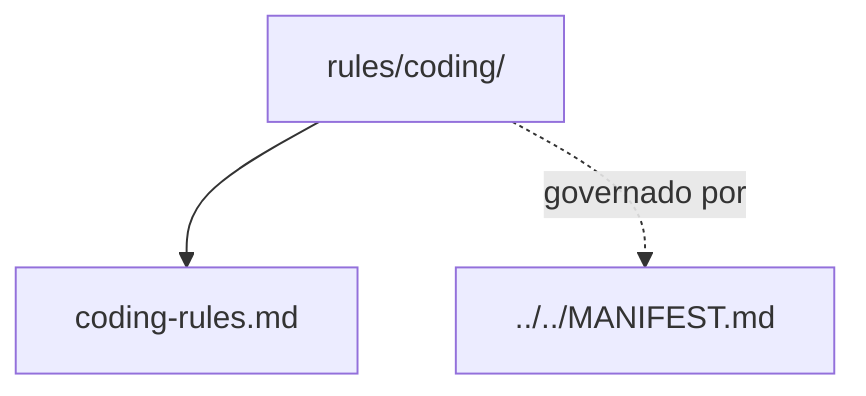

# coding

## Tipo do artefato

discovery

## Finalidade

O diretório `coding/` define normas de implementação para a saída produzida pelos agentes.

Este diretório é a fonte primária para regras de construção e organização de código.

A norma de maior precedência continua sendo:

- `../../MANIFEST.md`

---

## Dependências relacionadas

- `../../MANIFEST.md`
- `../README.md`

---

## Quando usar

Consulte `coding/` quando precisar:

- gerar código
- revisar estrutura de implementação
- padronizar organização interna
- restringir práticas de implementação

---

## Quando não usar

Não use `coding/` como fonte primária para:

- governança estrutural
- arquitetura de alto nível
- modelagem de dados
- nomenclatura global
- qualidade geral

Consulte, respectivamente:

- `../../governance/`
- `../architecture/`
- `../modeling/`
- `../naming/`
- `../quality/`

---

## Arquivo primário

- `./coding-rules.md`

---

## Responsabilidade desta pasta

`coding/` MUST definir normas de implementação.

`coding/` MUST NOT substituir arquitetura, naming, quality ou governance.

---

## Limites

Este README roteia normas de implementação.

Este README não substitui `./coding-rules.md`.

---

## Diagrama

## Status v0.1

Este diretorio faz parte da base v0.1 no escopo descrito neste README.

Uso aprovado: piloto profissional controlado. Producao critica exige controles externos de runtime, autorizacao, observabilidade e enforcement fora deste repositorio.
