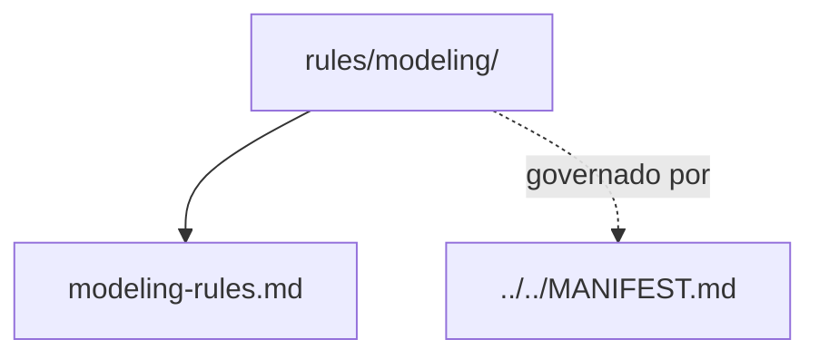

# modeling

## Tipo do artefato

discovery

## Finalidade

O diretório `modeling/` define normas de modelagem de dados e desenho estrutural de artefatos orientados a dados.

Este diretório é a fonte primária para regras de modelagem.

A norma de maior precedência continua sendo:

- `../../MANIFEST.md`

---

## Dependências relacionadas

- `../../MANIFEST.md`
- `../README.md`

---

## Quando usar

Consulte `modeling/` quando precisar:

- modelar entidades, contratos ou estruturas de dados
- revisar coerência de modelagem
- orientar granularidade e organização de dados
- reforçar consistência entre estrutura e domínio

---

## Quando não usar

Não use `modeling/` como fonte primária para:

- governança estrutural
- arquitetura geral
- implementação
- naming global
- qualidade geral

Consulte, respectivamente:

- `../../governance/`
- `../architecture/`
- `../coding/`
- `../naming/`
- `../quality/`

---

## Arquivo primário

- `./modeling-rules.md`

---

## Responsabilidade desta pasta

`modeling/` MUST definir regras de modelagem de dados.

`modeling/` MUST NOT absorver governança, coding ou naming.

---

## Limites

Este README roteia normas de modelagem.

Este README não substitui `./modeling-rules.md`.

---

## Diagrama

## Status v0.1

Este diretorio faz parte da base v0.1 no escopo descrito neste README.

Uso aprovado: piloto profissional controlado. Producao critica exige controles externos de runtime, autorizacao, observabilidade e enforcement fora deste repositorio.
