# naming

## Tipo do artefato

discovery

## Finalidade

O diretorio `naming/` define convencoes de nomenclatura semantica para artefatos produzidos por agentes em ambientes de engenharia de dados.

Este README e o roteador compacto do conjunto de naming. Ele ajuda o agente a encontrar a regra correta sem carregar todos os arquivos por habito.

A norma de maior precedencia continua sendo:

- `../../MANIFEST.md`

---

## Quando usar

Consulte `naming/` quando precisar:

- nomear colunas, variaveis, aliases ou campos
- revisar consistencia de nomenclatura
- reduzir ambiguidade em identificadores
- validar conformidade de naming
- selecionar regras de naming para um prompt, hook ou skill

---

## Quando nao usar

Nao use `naming/` como fonte primaria para:

- governanca estrutural
- arquitetura
- implementacao
- modelagem
- qualidade geral
- politica de naming

Consulte, respectivamente:

- `../../governance/`
- `../architecture/`
- `../coding/`
- `../modeling/`
- `../quality/`
- `../../governance/composition/semantic-naming-governance.md`

---

## Estrutura interna

```txt
naming/
  README.md
  _core-pattern.md
  rule-01-format.md
  rule-02-consistency.md
  rule-03-units.md
  rule-04-abbreviations.md
  rule-05-no-types.md
  rule-06-booleans.md
  rule-07-dates.md
  rule-08-foreign-keys.md
  rule-09-composition-order.md
  rule-10-avoid-generic.md
  reference-units.md
  reference-severity.md
```

---

## Fontes primarias

| Conceito | Fonte primaria |
|---|---|
| Padrao fundamental | `./_core-pattern.md` |
| Obrigacoes de naming | `./rule-01-format.md` a `./rule-10-avoid-generic.md` |
| Severidade e acao por violacao | `./reference-severity.md` |
| Unidades validas | `./reference-units.md` |
| Deteccao operacional | `../../skills/review/semantic-naming-detection.md` |
| Validacao operacional | `../../skills/review/semantic-naming-validation.md` |
| Auto-fix operacional | `../../skills/review/semantic-naming-autofix.md` |

---

## Regras

| Arquivo | Responsabilidade |
|---|---|
| `rule-01-format.md` | Formato lexical obrigatorio |
| `rule-02-consistency.md` | Consistencia semantica |
| `rule-03-units.md` | Obrigacao de unidade explicita |
| `rule-04-abbreviations.md` | Abreviacoes proibidas ou permitidas |
| `rule-05-no-types.md` | Proibicao de tipos tecnicos em nomes |
| `rule-06-booleans.md` | Padrao `is_`/`has_` para booleanos |
| `rule-07-dates.md` | Padrao `_date`/`_at` para datas |
| `rule-08-foreign-keys.md` | Padrao `<referenced_entity>_id` |
| `rule-09-composition-order.md` | Ordem `entity_detail_property_unit` |
| `rule-10-avoid-generic.md` | Proibicao de nomes genericos |

Severidade deve ser consultada em `./reference-severity.md`.

Decisao de auto-fix deve seguir `../../skills/review/semantic-naming-autofix.md`.

---

## Referencias

### `./reference-units.md`

Tabela de unidades validas por conceito.

### `./reference-severity.md`

Tabela de severidade e acao por tipo de violacao.

---

## Ordem de leitura recomendada

1. Comecar por `./_core-pattern.md`.
2. Selecionar regras especificas pelo escopo.
3. Consultar `./reference-severity.md` para acao e bloqueio.
4. Consultar `./reference-units.md` apenas quando houver valores mensuraveis.
5. Usar skills de review somente quando houver execucao de validacao, deteccao ou auto-fix.

---

## Uso pelo agente

Ao consumir `naming/`, o agente MUST:

- carregar apenas regras necessarias
- tratar normas como restricoes obrigatorias
- distinguir regra, referencia, skill e prompt
- usar `reference-severity.md` como fonte unica de severidade
- usar `reference-units.md` como fonte unica de unidades validas
- nao carregar `../../docs/` ou `../../evals/` por padrao

---

## Limites

Este README nao substitui:

- `./_core-pattern.md`
- regras especificas
- `./reference-units.md`
- `./reference-severity.md`
- skills de validacao, deteccao ou auto-fix

`naming/` MUST NOT absorver regras arquiteturais, de implementacao, modelagem ou qualidade geral.

---

## Diagrama

```mermaid
flowchart TD
    current["rules/naming/"]
    current --> n1["_core-pattern.md"]
    current --> n2["reference-severity.md"]
    current --> n3["reference-units.md"]
    current --> n4["rule-01-format.md"]
    current --> n5["rule-02-consistency.md"]
    current --> n6["rule-03-units.md"]
    current --> n7["rule-04-abbreviations.md"]
    current --> n8["rule-05-no-types.md"]
    current --> n9["rule-06-booleans.md"]
    current --> n10["rule-07-dates.md"]
    current --> n11["rule-08-foreign-keys.md"]
    current --> n12["rule-09-composition-order.md"]
    current --> n13["rule-10-avoid-generic.md"]
    current -. "governado por" .-> n14["../../MANIFEST.md"]
```



## Status v0.1

Este diretorio faz parte da base v0.1 no escopo descrito neste README.

Uso aprovado: piloto profissional controlado. Producao critica exige controles externos de runtime, autorizacao, observabilidade e enforcement fora deste repositorio.
