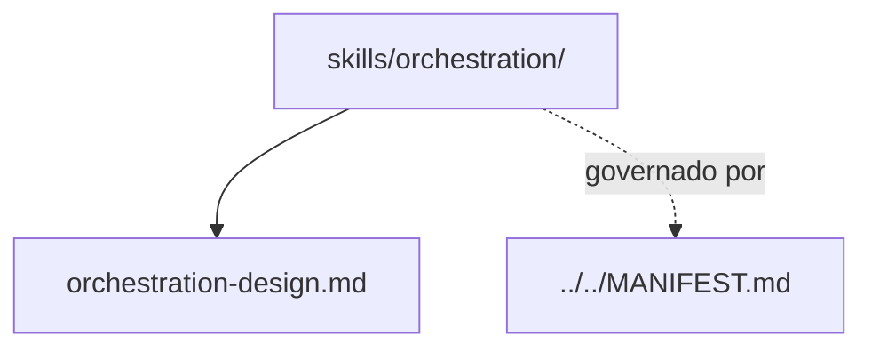

# orchestration

## Tipo do artefato

discovery

## Finalidade

O diretório `orchestration/` armazena conhecimento operacional reutilizável sobre orquestração de fluxos de dados.

Este diretório é a fonte primária para capacidades relacionadas a orquestração.

A norma de maior precedência continua sendo:

- `../../MANIFEST.md`

---

## Dependências relacionadas

- `../../MANIFEST.md`
- `../README.md`

---

## Quando usar

Consulte `orchestration/` quando precisar:

- estruturar execução em etapas
- organizar dependências entre fluxos
- desenhar encadeamento operacional
- revisar clareza da coordenação entre componentes

---

## Quando não usar

Não use `orchestration/` como fonte primária para:

- governança estrutural
- regras normativas de output
- definição de agente
- template de solicitação

Consulte, respectivamente:

- `../../governance/`
- `../../rules/`
- `../../agents/`
- `../../prompts/`

---

## Arquivo primário

- `./orchestration-design.md`

---

## Responsabilidade desta pasta

`orchestration/` MUST conter conhecimento operacional reutilizável sobre orquestração.

`orchestration/` MUST NOT conter governança, persona ou regra normativa primária.

---

## Limites

Este README roteia skills de orquestração.

Este README não substitui `./orchestration-design.md`.

---

## Diagrama

## Status v0.1

Este diretorio faz parte da base v0.1 no escopo descrito neste README.

Uso aprovado: piloto profissional controlado. Producao critica exige controles externos de runtime, autorizacao, observabilidade e enforcement fora deste repositorio.
