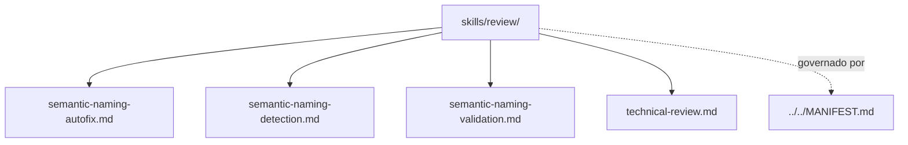

# review

## Tipo do artefato

discovery

## Finalidade

O diretório `review/` armazena conhecimento operacional reutilizável para revisão técnica de artefatos, fluxos e soluções de dados.

Este diretório é a fonte primária para capacidades de revisão técnica.

A norma de maior precedência continua sendo:

- `../../MANIFEST.md`

---

## Dependências relacionadas

- `../../MANIFEST.md`
- `../README.md`

---

## Quando usar

Consulte `review/` quando precisar:

- revisar solução existente
- orientar análise crítica técnica
- estruturar revisão antes de concluir
- melhorar consistência e sustentabilidade da entrega

---

## Quando não usar

Não use `review/` como fonte primária para:

- regras normativas de qualidade
- guardrails de validação por prompt
- governança estrutural
- definição de agente

Consulte, respectivamente:

- `../../rules/quality/`
- `../../prompts/hooks/`
- `../../governance/`
- `../../agents/`

---

## Arquivo primário

- `./technical-review.md`

---

## Responsabilidade desta pasta

`review/` MUST conter conhecimento operacional reutilizável sobre revisão técnica.

`review/` MUST NOT substituir normas primárias ou prompts de checkpoint.

---

## Limites

Este README roteia skills de revisão.

Este README não substitui skills específicas deste diretório.

---

## Diagrama

## Status v0.1

Este diretorio faz parte da base v0.1 no escopo descrito neste README.

Uso aprovado: piloto profissional controlado. Producao critica exige controles externos de runtime, autorizacao, observabilidade e enforcement fora deste repositorio.
