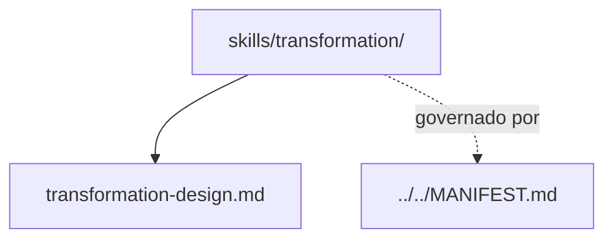

# transformation

## Tipo do artefato

discovery

## Finalidade

O diretório `transformation/` armazena conhecimento operacional reutilizável sobre transformação de dados.

Este diretório é a fonte primária para capacidades relacionadas a transformação.

A norma de maior precedência continua sendo:

- `../../MANIFEST.md`

---

## Dependências relacionadas

- `../../MANIFEST.md`
- `../README.md`

---

## Quando usar

Consulte `transformation/` quando precisar:

- estruturar transformação de dados
- organizar etapas de processamento
- revisar clareza e responsabilidade da transformação
- orientar decisões operacionais em fluxos transformacionais

---

## Quando não usar

Não use `transformation/` como fonte primária para:

- regras normativas de output
- governança estrutural
- definição de agente
- template de solicitação

Consulte, respectivamente:

- `../../rules/`
- `../../governance/`
- `../../agents/`
- `../../prompts/`

---

## Arquivo primário

- `./transformation-design.md`

---

## Responsabilidade desta pasta

`transformation/` MUST conter conhecimento operacional reutilizável sobre transformação.

`transformation/` MUST NOT conter regra normativa primária, persona ou governança.

---

## Limites

Este README roteia skills de transformação.

Este README não substitui `./transformation-design.md`.

---

## Diagrama

## Status v0.1

Este diretorio faz parte da base v0.1 no escopo descrito neste README.

Uso aprovado: piloto profissional controlado. Producao critica exige controles externos de runtime, autorizacao, observabilidade e enforcement fora deste repositorio.
